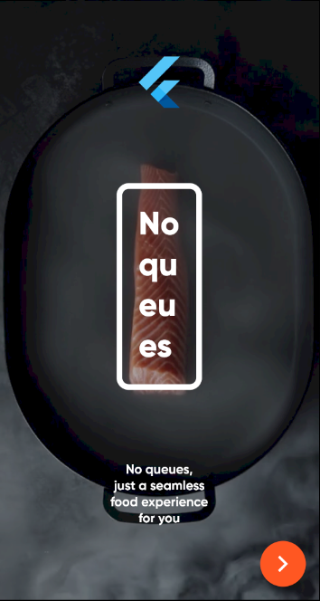
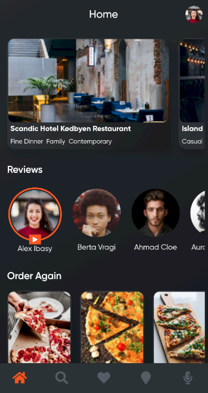
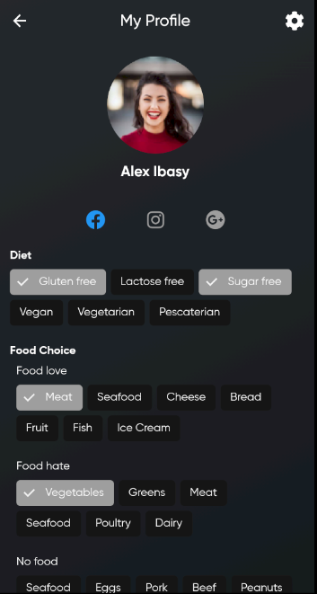
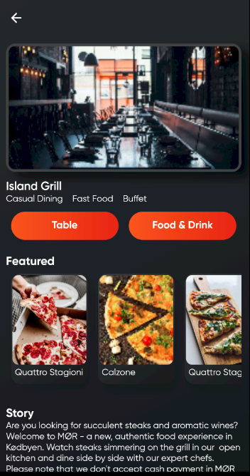
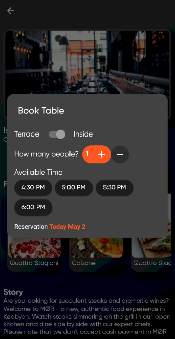
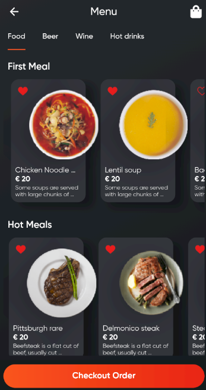
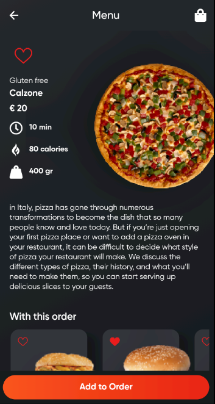
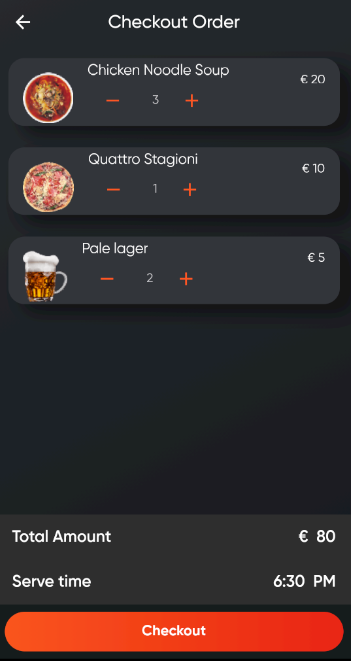

# Food Delivery App UI (WIP)
Design credits belong to respective owners. Check their other works from [*here*](https://www.behance.net/gallery/105003531/No-queues-Mobile-App-Delivery-Pre-Order)

If you want to test it you can install [this apk](ss/app-release.apk) to your device

# Screenshots

  
  
  
  
  
  
  
  

Images from [Unsplash](unsplash.com) and [pngimg.com](http://pngimg.com/)
# Used Libraries
[cached_network_image](https://pub.dev/packages/cached_network_image)  
[firebase_core](https://pub.dev/packages/firebase_core)  
[firebase_database](https://pub.dev/packages/firebase_database)  
[firebase_storage](https://pub.dev/packages/firebase_storage)  
[flutter_staggered_animations](https://pub.dev/packages/flutter_staggered_animations)  
[font_awesome_flutter](https://pub.dev/packages/font_awesome_flutter)  
[http](https://pub.dev/packages/http)  
[lottie](https://pub.dev/packages/lottie)  
[video_player](https://pub.dev/packages/http)  

